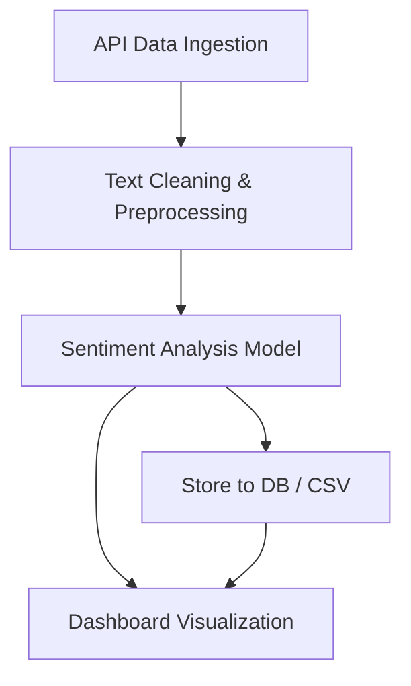

<p align="center">
  
</p>

<h1 align="center">Real-Time Sentiment Analysis Pipeline 💬📊</h1>

<p align="center">
  A production-ready pipeline that scrapes Reddit and YouTube comments, classifies sentiment using NLP models, and visualizes results in Power BI — all orchestrated through Apache Airflow.
</p>

<p align="center">
  
  
  
  
  
</p>

---

## 📌 Overview

This project implements a **real-time sentiment analysis pipeline** for public social media content using:

- Apache Airflow for end-to-end orchestration
- Python-based NLP pipelines
- Hugging Face models for sentiment classification
- Power BI for trend visualization

It's modular, scalable, and deployable for any organization interested in public sentiment monitoring.

---

## ⚙️ Tech Stack

| Layer              | Tools & Libraries |
|--------------------|------------------|
| 🧠 NLP              | Hugging Face 🤗, NLTK, TextBlob |
| 🔄 Orchestration    | Apache Airflow |
| 📊 Visualization    | Power BI |
| 🔌 APIs             | Reddit API (PRAW), YouTube Comments |
| 🧹 Preprocessing     | Pandas, Regex, Custom Python Scripts |
| 🧪 Testing           | Sample datasets + DAG validation |

---

## 🚀 Features

- ✅ Real-time scraping from Reddit and YouTube
- ✅ Sentiment classification using Hugging Face transformers
- ✅ Apache Airflow DAG for complete automation
- ✅ Power BI dashboard for visualization
- ✅ Modular, clean, production-grade pipeline

---

## 🔄 Pipeline Architecture



---

## 🛰️ Airflow DAG Structure

This project uses **Apache Airflow** to orchestrate each stage in the sentiment pipeline. Here's the real DAG flow:

```
start
├── clean_youtube_data_dag
│   └── label_youtube
│       └── validate_youtube_labels
├── clean_reddit_data_dag
│   └── label_reddit
│       └── validate_reddit_labels
       └── merge_labeled_data
           └── end
```

> DAG Status Screenshot:  


> 🛠️ Place your DAG in the `dags/` folder and run the Airflow web server to view it.

---

## 🛠️ How to Run Locally

```bash
# Clone the repo
git clone https://github.com/Abhinav-source2/Real-time-Sentiment-Analysis-Pipeline.git
cd Real-time-Sentiment-Analysis-Pipeline

# Install Python dependencies
pip install -r requirements.txt

# (Optional) Set up virtual environment
python -m venv venv
source venv/bin/activate  # Windows: venv\Scripts\activate

# Run sentiment pipeline
python sentiment_pipeline.py
```

---

## ⚙️ How to Run Airflow

> Requires Docker or local Airflow installation

```bash
# Initialize Airflow
airflow db init

# Start scheduler and webserver
airflow scheduler
airflow webserver

# Place your DAG file into the /dags folder
```

> Access the DAG UI at: http://localhost:8080

---

## 📊 Power BI Dashboard

This project includes a `.pbix` file which:
- Shows visual trends of sentiment over time
- Highlights comparisons between Reddit & YouTube sentiment
- Allows filters by keyword, date, and platform

📂 File: `dashboards/sentiment_dashboard.pbix`  
⚠️ Due to GitHub’s file size limits, download it via: [Google Drive Link](#)

---

## 📁 Folder Structure

```
📦 Real-time-Sentiment-Analysis-Pipeline
├── dags/
│   └── sentiment_dag.py
├── data/ (excluded from GitHub)
├── models/
├── utils/
├── dashboards/
│   └── sentiment_dashboard.pbix
├── requirements.txt
├── sentiment_pipeline.py
└── README.md
```

---

## 📚 References

- [Apache Airflow](https://airflow.apache.org/)
- [Hugging Face Transformers](https://huggingface.co/)
- [Twitter & Reddit API Docs](https://developer.twitter.com/)
- [Power BI Docs](https://learn.microsoft.com/en-us/power-bi/)

---

## 👤 Author

**Abhinav Jajoo**  
🎓 B.Tech CSE @ JK Lakshmipat University (2022–2026)  
📧 abhinav.jajoo@example.com  

---

## 📝 License

This project is licensed under the **MIT License**.

---
